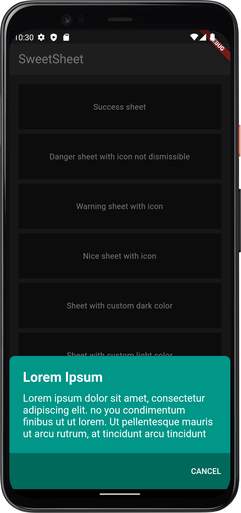

# Flutter Sweet Sheet

## Features

* Custom child widgets
* Adaptive design

## Supported platforms

* Flutter Android
* Flutter iOS
* Flutter web
* Flutter desktop
* Flutter macOS
* Flutter linux

## Installation

Add `flutter_sweet_sheet: <later-version>` to your `pubspec.yaml` dependencies. And import it:

```
import 'package:flutter_sweet_sheet/flutter_sweet_sheet.dart';
```

#### How to Use ####

## How to Use ##
create object
```
final SweetSheet _sweetSheet = SweetSheet();
```

##Example

```          
 _sweetSheet.show(
      context: context,
      title: const Text("Lorem Ipsum"),
      description: const Text(
          "Lorem ipsum dolor sit amet, consectetur adipiscing elit. no you condimentum finibus ut ut lorem. Ut pellentesque mauris ut arcu rutrum, at tincidunt arcu tincidunt"),
      color: SweetSheetColor.success,
      positive: SweetSheetAction(
        onPressed: () {
          Navigator.of(context).pop();
        },
        title: 'CANCEL',
      ),
    );
```

## Add Buttons

```
 _sweetSheet.show(
     ...
      positive: SweetSheetAction(
        onPressed: () {
          Navigator.of(context).pop();
        },
        title: 'CONTINUE',
      ),
      negative: SweetSheetAction(
        onPressed: () {
          Navigator.of(context).pop();
        },
        title: 'CANCEL',
      ),
    );
```
## Default Color

The `SweetSheetColor` is a class which have four static values and it determine the color of the sheet by creating a `CustomSheetColor`:

- SweetSheetColor.success (green)
- SweetSheetColor.danger (red)
- SweetSheetColor.warning (orange)
- SweetSheetColor.nice (blue)

## Custom color

```
 _sweetSheet.show(
      ...
      color: CustomSheetColor(
        mainColor: Colors.white,
        accentColor: const Color(0xff5A67D8),
        iconColor: const Color(0xff5A67D8),
      ),
      ...
    ); 
```

## Screenshot
|                    nice                    |                    warning                    |
| :----------------------------------------: | :-------------------------------------------: |
|                            |                               |
|                            |                               |
|                            |                               |

